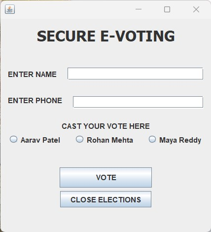
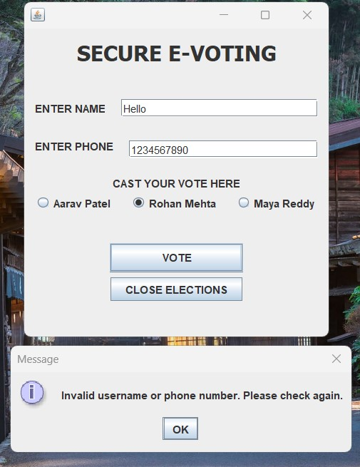
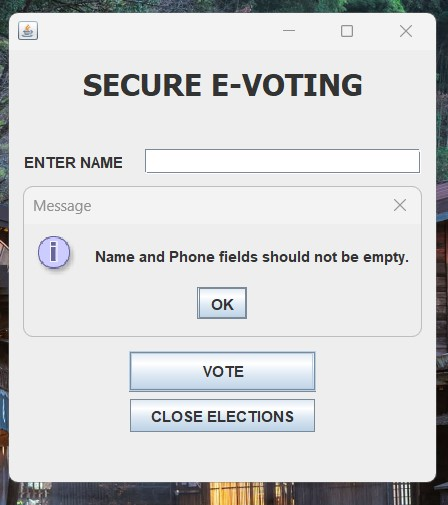
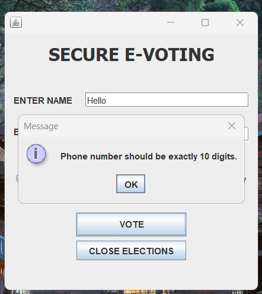
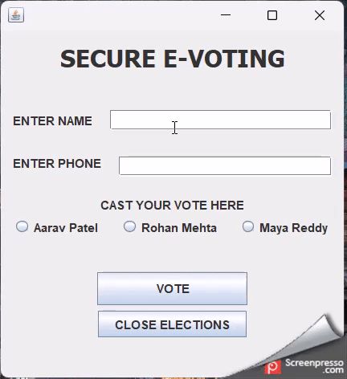

# 20CYS383 Java Programming Lab
  
 
## E - Voting

### Project Description

<p text-align: justify;>The E-Voting System is an electronic voting application developed in Java. It provides a user-friendly graphical user interface (GUI) that allows users to register as voters, register candidates, cast votes, and view voting results. The system is designed to streamline the voting process and ensure secure and accurate vote counting.</p>

### Code

#### E_Voting.java
```
package com.amrita.jpl.cys21039.PROJECT;

import javax.swing.*;
import javax.swing.table.DefaultTableModel;
import java.awt.*;
import java.awt.event.ActionEvent;
import java.awt.event.ActionListener;
import java.io.IOException;
import java.nio.file.Files;
import java.nio.file.Path;
import java.nio.file.StandardOpenOption;
import java.util.ArrayList;
import java.util.HashMap;
import java.util.List;
import java.util.Map;

/**
 * The class represents an electronic voting application.
 * It allows users to register as voters, register candidates, cast votes, and view voting results.
 * The application uses a graphical user interface (GUI) built with Swing.
 */
public class E_Voting extends JFrame {

    private Map<String, String> registeredVoters; // Store registered voters (voterID -> password)
    private List<String> candidates; // Store the list of candidates
    private Map<String, Integer> voteCounts; // Store vote counts for each candidate

    private JTabbedPane tabbedPane;
    private JTextField voterIDField;
    private JPasswordField passwordField;
    private JButton registerButton;
    private JTable registeredCandidatesTable; // Table to display registered candidates
    private JTable registeredVotersTable; // Table to display registered voter IDs
    private JComboBox<String> candidateComboBox;
    private JButton voteButton;
    private JButton countVotesButton;
    private JButton showVoterIDsButton;

    /**
     * Constructs an object and initializes Swing components.
     */
    public E_Voting() {
        registeredVoters = new HashMap<>();
        candidates = new ArrayList<>();
        voteCounts = new HashMap<>();

        // Initialize Swing components
        voterIDField = new JTextField(20);
        passwordField = new JPasswordField(20);
        registerButton = new JButton("Register");
        candidateComboBox = new JComboBox<>();
        voteButton = new JButton("Vote");
        countVotesButton = new JButton("Count Votes");
        showVoterIDsButton = new JButton("Show Voter IDs");

        // Set layout
        setLayout(new GridLayout(1, 1));

        // Create tabbed pane
        tabbedPane = new JTabbedPane();

        // Create registration tab
        JPanel registrationPanel = new JPanel(new BorderLayout());

        // Create buttons panel
        JPanel buttonsPanel = new JPanel(new FlowLayout());
        JButton voterRegistrationButton = new JButton("Voter ID Registration");
        JButton candidateRegistrationButton = new JButton("Candidate Registration");
        buttonsPanel.add(voterRegistrationButton);
        buttonsPanel.add(candidateRegistrationButton);
        registrationPanel.add(buttonsPanel, BorderLayout.NORTH);

        // Create registered candidates table
        Object[] columnNames = {"Registered Candidates"};
        Object[][] data = {}; // Empty data initially
        DefaultTableModel candidateTableModel = new DefaultTableModel(data, columnNames);
        registeredCandidatesTable = new JTable(candidateTableModel);
        JScrollPane candidateScrollPane = new JScrollPane(registeredCandidatesTable);
        registrationPanel.add(candidateScrollPane, BorderLayout.WEST);

        // Create registered voter IDs table
        Object[] voterIDColumnNames = {"Registered Voter IDs"};
        Object[][] voterIDData = {}; // Empty data initially
        DefaultTableModel voterIDTableModel = new DefaultTableModel(voterIDData, voterIDColumnNames);
        registeredVotersTable = new JTable(voterIDTableModel);
        JScrollPane voterIDScrollPane = new JScrollPane(registeredVotersTable);
        registrationPanel.add(voterIDScrollPane, BorderLayout.CENTER);

        tabbedPane.addTab("Registration", registrationPanel);

        // Create voting tab
        JPanel votingPanel = new JPanel(new FlowLayout());
        votingPanel.add(new JLabel("Voter ID:"));
        JTextField voterIDFieldVoting = new JTextField(20);
        votingPanel.add(voterIDFieldVoting);
        votingPanel.add(new JLabel("Password:"));
        JPasswordField passwordFieldVoting = new JPasswordField(20);
        votingPanel.add(passwordFieldVoting);
        votingPanel.add(new JLabel("Select Candidate:"));
        votingPanel.add(candidateComboBox);
        votingPanel.add(voteButton);
        tabbedPane.addTab("Voting", votingPanel);

        // Create results tab
        JPanel resultsPanel = new JPanel(new FlowLayout());
        resultsPanel.add(countVotesButton);
        resultsPanel.add(showVoterIDsButton);
        tabbedPane.addTab("Results", resultsPanel);

        // Add tabbed pane to the frame
        add(tabbedPane);

        // Add action listeners
        voterRegistrationButton.addActionListener(new ActionListener() {
            @Override
            public void actionPerformed(ActionEvent e) {
                // Prompt the user to enter the number of voter IDs to create
                String numVoterIDsInput = JOptionPane.showInputDialog(E_Voting.this, "Enter the number of voter IDs to create:");

                if (numVoterIDsInput != null) {
                    int numVoterIDs = Integer.parseInt(numVoterIDsInput);

                    // Loop to create the specified number of voter IDs
                    for (int i = 1; i <= numVoterIDs; i++) {
                        JTextField voterIDField = new JTextField(20);
                        JPasswordField passwordField = new JPasswordField(20);

                        JPanel inputPanel = new JPanel(new GridLayout(2, 2));
                        inputPanel.add(new JLabel("Voter ID:"));
                        inputPanel.add(voterIDField);
                        inputPanel.add(new JLabel("Password:"));
                        inputPanel.add(passwordField);

                        // Display a dialog to input the voter ID and password
                        int option = JOptionPane.showConfirmDialog(
                                E_Voting.this,
                                inputPanel,
                                "Voter ID Registration",
                                JOptionPane.OK_CANCEL_OPTION,
                                JOptionPane.PLAIN_MESSAGE
                        );

                        if (option == JOptionPane.OK_OPTION) {
                            String voterID = voterIDField.getText();
                            String password = new String(passwordField.getPassword());
                            register(voterID, password);
                        } else {
                            break; // Cancel registration if user presses Cancel or closes the dialog
                        }
                    }
                }
            }
        });

        candidateRegistrationButton.addActionListener(new ActionListener() {
            @Override
            public void actionPerformed(ActionEvent e) {
                // Prompt the user to enter the number of candidates
                String numCandidatesInput = JOptionPane.showInputDialog(E_Voting.this, "Enter the number of candidates:");

                if (numCandidatesInput != null) {
                    int numCandidates = Integer.parseInt(numCandidatesInput);

                    // Loop to register the specified number of candidates
                    for (int i = 1; i <= numCandidates; i++) {
                        String candidateName = JOptionPane.showInputDialog(E_Voting.this, "Enter candidate name " + i + ":");

                        if (candidateName != null) {
                            if (registeredVoters.containsKey(candidateName)) {
                                JOptionPane.showMessageDialog(E_Voting.this, "Candidate name cannot be the same as a registered voter ID. Please choose a different candidate name.");
                            } else if (candidates.contains(candidateName)) {
                                JOptionPane.showMessageDialog(E_Voting.this, "Candidate name already exists. Please choose a different candidate name.");
                            } else {
                                addCandidateName(candidateName);
                            }
                        } else {
                            break; // Cancel candidate registration if user presses Cancel or closes the dialog
                        }
                    }
                }
            }
        });

        registerButton.addActionListener(new ActionListener() {
            @Override
            public void actionPerformed(ActionEvent e) {
                String voterID = voterIDField.getText();
                String password = new String(passwordField.getPassword());
                register(voterID, password);
            }
        });

        voteButton.addActionListener(new ActionListener() {
            @Override
            public void actionPerformed(ActionEvent e) {
                String voterID = voterIDFieldVoting.getText();
                String password = new String(passwordFieldVoting.getPassword());

                // Verify the voter ID and password
                if (!registeredVoters.containsKey(voterID) || !registeredVoters.get(voterID).equals(password)) {
                    JOptionPane.showMessageDialog(E_Voting.this, "Invalid voter ID or password. Please try again.");
                    return;
                }

                String selectedCandidate = (String) candidateComboBox.getSelectedItem();
                vote(selectedCandidate, voterID);

                // Clear the fields
                voterIDFieldVoting.setText("");
                passwordFieldVoting.setText("");
            }
        });

        countVotesButton.addActionListener(new ActionListener() {
            @Override
            public void actionPerformed(ActionEvent e) {
                countVotes();
            }
        });

        showVoterIDsButton.addActionListener(new ActionListener() {
            @Override
            public void actionPerformed(ActionEvent e) {
                showVoterIDs();
            }
        });
    }

    /**
     * Registers a voter with the given voter ID and password.
     *
     * @param voterID  the ID of the voter to register
     * @param password the password of the voter
     */
    private void register(String voterID, String password) {
        if (registeredVoters.containsKey(voterID)) {
            JOptionPane.showMessageDialog(this, "Voter ID already exists. Please choose a different Voter ID.");
        } else if (candidates.contains(voterID)) {
            JOptionPane.showMessageDialog(this, "Voter ID cannot be the same as a candidate name. Please choose a different Voter ID.");
        } else {
            registeredVoters.put(voterID, password);
            JOptionPane.showMessageDialog(this, "Registration successful!");
            voterIDField.setText("");
            passwordField.setText("");
            updateRegisteredVotersTable();
        }
    }

    /**
     * Casts a vote for the given candidate.
     *
     * @param candidate the candidate to vote for
     * @param voterID   the ID of the voter casting the vote
     */
    private void vote(String candidate, String voterID) {
        // Check if the voter has already cast a vote
        if (voteCounts.containsKey(voterID)) {
            JOptionPane.showMessageDialog(this, "You have already cast a vote.");
            return;
        }

        if (candidates.contains(candidate)) {
            if (!voteCounts.containsKey(candidate)) {
                voteCounts.put(candidate, 1);
            } else {
                int count = voteCounts.get(candidate);
                voteCounts.put(candidate, count + 1);
            }
        }

        // Add the voter to the voteCounts map to track their vote
        voteCounts.put(voterID, 1);

        JOptionPane.showMessageDialog(this, "Vote cast successfully!");
        candidateComboBox.setSelectedIndex(0);
    }

    /**
     * Displays the current vote counts for each candidate in a dialog box.
     * Saves the vote counts to a file named "vote.txt".
     */
    private void countVotes() {
        StringBuilder result = new StringBuilder("Vote Counts:\n");
        for (Map.Entry<String, Integer> entry : voteCounts.entrySet()) {
            String candidate = entry.getKey();
            if (!registeredVoters.containsKey(candidate)) {
                int votes = entry.getValue();
                result.append("Candidate: ").append(candidate).append(", Votes: ").append(votes).append("\n");
            }
        }
        JOptionPane.showMessageDialog(this, result.toString());

        // Save vote counts to file
        saveVoteCountsToFile();
    }

    /**
     * Displays the list of registered voter IDs in a dialog box.
     */
    private void showVoterIDs() {
        StringBuilder result = new StringBuilder("Registered Voter IDs:\n");
        for (String voterID : registeredVoters.keySet()) {
            result.append(voterID).append("\n");
        }
        JOptionPane.showMessageDialog(this, result.toString());
    }

    /**
     * Saves the vote counts to a file named "vote.txt".
     * Appends the current vote counts to the existing file or creates a new file if it doesn't exist.
     */
    private void saveVoteCountsToFile() {
        Path filePath = Path.of("vote.txt");
        try {
            if (Files.notExists(filePath)) {
                Files.createFile(filePath);
            }

            StringBuilder fileContent = new StringBuilder();
            for (Map.Entry<String, Integer> entry : voteCounts.entrySet()) {
                String candidate = entry.getKey();
                if (!registeredVoters.containsKey(candidate)) {
                    int votes = entry.getValue();
                    fileContent.append(candidate).append(",").append(votes).append(System.lineSeparator());
                }
            }

            Files.write(filePath, fileContent.toString().getBytes(), StandardOpenOption.APPEND);
            JOptionPane.showMessageDialog(this, "Vote counts saved to file successfully!");
        } catch (IOException e) {
            JOptionPane.showMessageDialog(this, "Error saving vote counts to file: " + e.getMessage());
        }
    }

    /**
     * Adds a candidate name to the list of candidates and the candidate selection combo box.
     *
     * @param candidateName the name of the candidate to add
     */
    public void addCandidateName(String candidateName) {
        candidates.add(candidateName);
        candidateComboBox.addItem(candidateName);
        DefaultTableModel candidateTableModel = (DefaultTableModel) registeredCandidatesTable.getModel();
        candidateTableModel.addRow(new Object[]{candidateName});
    }

    /**
     * The entry point of the program.
     * Prompts the user to enter the number of candidates and their names, then starts the application.
     *
     * @param args command-line arguments (not used)
     */
    public static void main(String[] args) {
        E_Voting application = new E_Voting();

        application.setSize(400, 200);
        application.setDefaultCloseOperation(JFrame.EXIT_ON_CLOSE);
        application.setVisible(true);
    }

    /**
     * Updates the content of the registered voter IDs table.
     */
    private void updateRegisteredVotersTable() {
        DefaultTableModel voterIDTableModel = (DefaultTableModel) registeredVotersTable.getModel();
        voterIDTableModel.setRowCount(0); // Clear the table

        for (String voterID : registeredVoters.keySet()) {
            voterIDTableModel.addRow(new Object[]{voterID});
        }
    }
}
```
### Demo
#### Screenshots

<center></center>
<center></center>
<center></center>
<center></center>
<center></center>
<center></center>
<center></center>
<center></center>
<center></center>

#### Video


